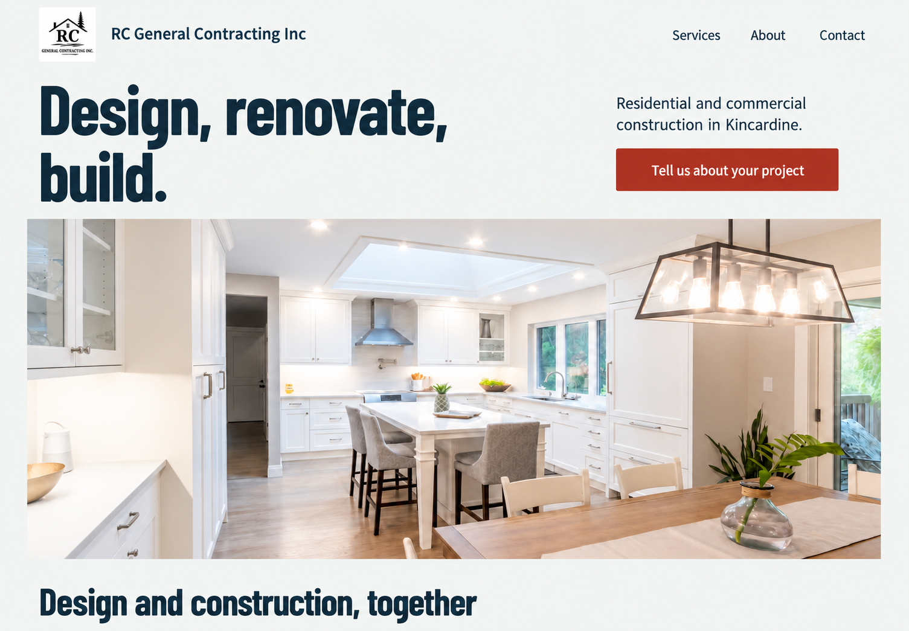
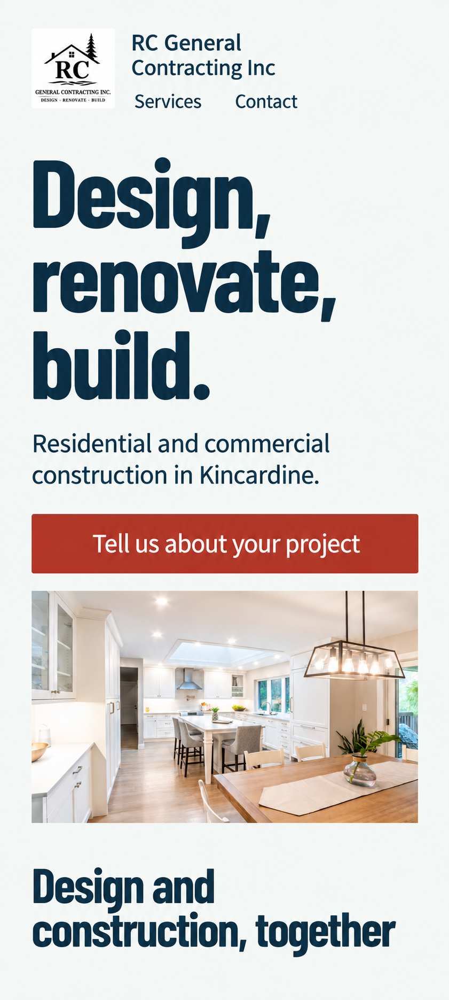
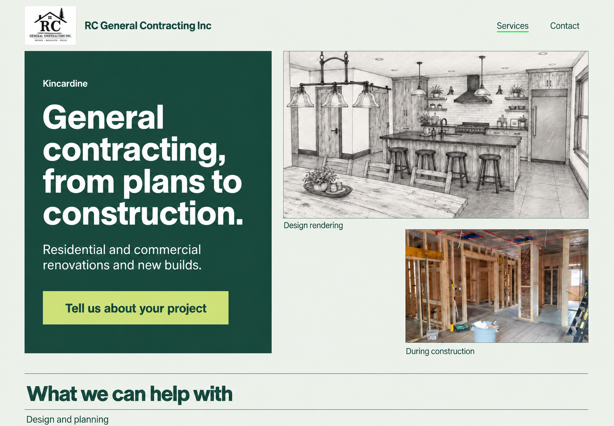
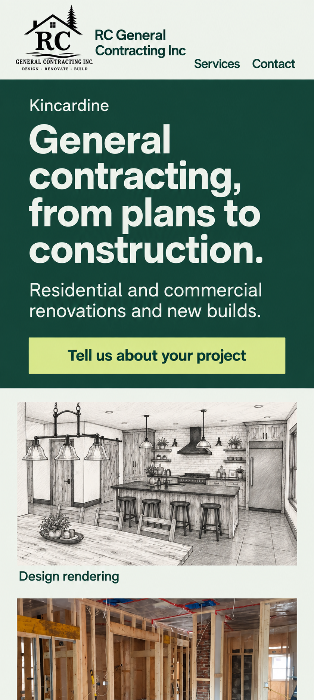

# Two design directions

Status: the owner selected **A. Rooms in focus** through the comparison page on 23 September 2026. The chosen system is recorded in `DESIGN.md` before implementation. Both proposals remain here as the decision record. Copy approval is still separate.

The home page helps a visitor understand the company, see its work, and enquire. The services page helps the same visitor check project fit. Both use Impeccable's **Persuade** mode. The primary action is **Tell us about your project**, linking to `/contact/`. Services remains a visible secondary route. Home retains its `#contact` section.

Both proposals use the existing roof/tree/RC logo and approved company imagery. Image filenames are unreliable: the file labelled “company van” is a kitchen. The rendering and framing photo are separate examples; there is no evidence they show one project. They must never be presented as a before-and-after sequence.

## A. Rooms in focus

An open photographic layout, derived from residential architecture magazines. The company name and purpose are easy to find; the completed kitchen supplies the main visual evidence. The wide photograph is the signature of this direction, with compact, expressive headings and quieter reading columns beneath it.



### Type and colour

**Barlow Condensed 600** for headings, paired with **Source Sans 3 400/600** for body text, navigation, and controls. Display type is upright and in sentence case. Desktop H1: 96–112px with a 0.98 line height; mobile H1: 56px with a 1.02 line height. H2: 48px desktop and 36px mobile. Body: 18px/1.6; captions and navigation: 16px/1.4. Text columns stop at 64 characters.

The palette draws on the cool whites, dark fixtures, and warm wood in the existing kitchen photo. Most surfaces stay pale. Brick red identifies the enquiry action; it is never spread across decorative panels. Dark mode uses blue-tinted surfaces with light text, while the logo retains its original white backing.

```css
/* Proposed tokens, not application code. */
:root {
  --color-bg: #f4f6f4;
  --color-surface: #ffffff;
  --color-soft: #dce5e7;
  --color-ink: #172d39;
  --color-action: #a43120;
  --color-on-action: #ffffff;
  --color-control-border: #687b82;
  --color-divider: #c2ced1;
  --color-focus: #a43120;
  --color-error: #a43120;
  --color-success: #24533f;
}
[data-theme="dark"] {
  --color-bg: #12232c;
  --color-surface: #1c3541;
  --color-soft: #244653;
  --color-ink: #f4f6f4;
  --color-action: #ff9b7d;
  --color-on-action: #12232c;
  --color-control-border: #95aab2;
  --color-divider: #46616c;
  --color-focus: #ff9b7d;
  --color-error: #ffb4a2;
  --color-success: #b9dfc6;
}
```

### Home: hero and one content section

A compact header holds the original logo, company name, and Services, About, Contact navigation. The hero starts with **Design, renovate, build.** The adjacent copy reads **Residential and commercial construction in Kincardine.** A brick-red enquiry button appears before the photograph. The kitchen then spans almost the full content width, without text across its details. At 1440px, the content has 48px side margins and a maximum width of 1440px.

The next section, **Design and construction, together**, places a short introduction in a narrow left column and the existing services in wider text rows on the right. A clearly captioned design rendering follows the design row. Later sections preserve company history, working practices, the framing photo, all three reviews, the rating count, and home contact content. The layout changes with the material; it does not repeat the same image/text split down the page.

### Services: hero and one content section

The heading **Renovations, new builds and the work in between** occupies a broad type field above a shallow crop of the framing photo. The complete photo remains available lower on the page; a crop cannot substitute for preserved content. The intro reads **We provide residential and commercial construction services, including design, engineering and permits.** The enquiry action stays beside the intro.

Below, **From drawings to finishing work** uses an open two-column service index. The left column contains in-page links; the right holds complete, visible descriptions grouped as design and planning, renovations and new builds, and construction and finishing. Grouping is editorial, not a new claim. Every source service is named. On mobile the index becomes ordinary wrapped anchor links above the content, not a horizontal scroller or an accordion that hides the service list.

### At 360px



There are 24px gutters and 312px of usable width. The header wraps into two short rows: brand first, visible navigation second. The hero title wraps naturally, with no forced desktop line breaks. Body copy and a full-width 48px-tall button precede a 3:2 kitchen image. The compact header is allowed to grow to fit the real brand and visible links; a fixed header height must not clip them. Sections use a single column with 56px vertical separation. Links wrap; labels and messages expand the page vertically.

The services page follows this order at 360px:

```text
┌────────────── 360px ──────────────┐
│ RC logo / company name           │
│ Services       About     Contact │
│                                  │
│ Renovations, new builds          │
│ and the work in between          │
│ Residential and commercial…      │
│ [Tell us about your project]     │
│                                  │
│ [Framing photograph, 4:3]        │
│ During construction              │
│                                  │
│ From drawings to finishing work  │
│ Design / Renovations / Finishing │
│                                  │
│ Design and planning              │
│ Full description, then next group│
└──────────────────────────────────┘
```

**Tradeoff:** the large kitchen photo is welcoming, but can initially suggest a kitchen specialist. The explicit residential/commercial introduction and early service list must prevent that narrowing.

## B. Plans into places

An architectural presentation board translated into a practical website. A substantial green introduction sits beside separately captioned design and construction images. The layout makes the scope of the company visible before the visitor reads its history. No decorative blueprint lines, measurement ticks, or invented project identifiers are added.



### Type and colour

**Archivo 600** for headings, paired with **Public Sans 400/600** for reading and controls. Desktop H1: 64–72px/1.05; mobile H1: 40px/1.08. H2: 44px desktop and 32px mobile. Body: 18px/1.6; navigation and captions: 16px/1.4. The wider display face gives longer service names room without resorting to tiny type.

Fir green relates to the tree in the existing identity. A pale mineral green supports the rendering and warm framing photo; lime marks the primary action. Green surfaces always use light text, never muted gray. Dark mode keeps the same accent and raises image captions to the light text colour.

```css
/* Proposed tokens, not application code. */
:root {
  --color-bg: #eff3ec;
  --color-surface: #ffffff;
  --color-soft: #dce6d7;
  --color-ink: #173e33;
  --color-brand-panel: #173e33;
  --color-on-brand: #eff3ec;
  --color-action: #d8ec82;
  --color-on-action: #173e33;
  --color-control-border: #637964;
  --color-divider: #bdcdb9;
  --color-focus: #173e33;
  --color-error: #a43120;
  --color-success: #24533f;
}
[data-theme="dark"] {
  --color-bg: #102d25;
  --color-surface: #1a3b31;
  --color-soft: #244c3f;
  --color-ink: #f1f6ea;
  --color-brand-panel: #173e33;
  --color-on-brand: #f1f6ea;
  --color-action: #d8ec82;
  --color-on-action: #173e33;
  --color-control-border: #9bb39b;
  --color-divider: #49674f;
  --color-focus: #d8ec82;
  --color-error: #ffb4a2;
  --color-success: #b9dfc6;
}
```

### Home: hero and one content section

The header uses the same visible routes as A. A twelve-column layout gives five columns to the green introduction and seven to the image arrangement. The headline reads **General contracting, from plans to construction.** The body reads **Residential and commercial renovations and new builds.** Kincardine appears above the headline. The lime enquiry button anchors the text column. The kitchen rendering and framing photo carry separate captions: **Design rendering** and **During construction**. There is no connecting arrow or suggestion of a shared project.

The next section, **What we can help with**, is a list of broad service groups with short descriptions and links to the relevant services-page anchors. Its scale and spacing echo a presentation board's labels, without adding numbered stages or promised timelines. The completed kitchen photo receives its own wider section below. Company history, work practices, reviews, rating count, and contact all remain represented.

### Services: hero and one content section

The green title band reads **Design, renovation and construction services**. The intro reads **From drawings and permits to framing, cabinetry and finishing work.** The design rendering sits in a large pale field alongside the title on desktop, explicitly labelled as a rendering. An enquiry button sits under the introduction.

The following section, **Work we take on**, arranges service names as a readable index at left with full descriptions at right. A small framing image accompanies construction and finishing, not every row. All service groups are open by default. There are no invented project stages, estimates, price brackets, or service promises.

### At 360px



The header wraps to two rows with visible navigation. The green introduction occupies the full width, with 24px internal gutters. Its 40px heading, 18px body, and 48px action precede the images. The rendering and framing photograph stack at a useful 4:3 size, each with its caption; they do not become two unreadable thumbnails. Service groups become stacked text sections separated by space and a single rule.

The services page follows this order at 360px:

```text
┌────────────── 360px ──────────────┐
│ RC logo / company name           │
│ Services       About     Contact │
├──────────────────────────────────┤
│ Green title area                 │
│ Design, renovation and           │
│ construction services            │
│ From drawings and permits…       │
│ [Tell us about your project]     │
├──────────────────────────────────┤
│ [Rendering, 4:3]                 │
│ Design rendering                 │
│                                  │
│ Work we take on                  │
│ Design and planning              │
│ Full description                │
│ Renovations and new builds       │
│ Full description                │
│ Construction and finishing       │
└──────────────────────────────────┘
```

**Tradeoff:** this explains construction scope sooner, but the rendering is less immediate than a finished-room photograph. The completed kitchen must appear soon after the service introduction. Presentation-board layouts are familiar; the approved imagery and complete service copy give this one its identity.

## Shared spacing, motion, and behaviour

Both systems use these spacing steps. Their compositions differ rather than relying on different arbitrary pixel scales.

```css
--space-1: 0.25rem; /* 4px */
--space-2: 0.5rem;  /* 8px */
--space-3: 0.75rem; /* 12px */
--space-4: 1rem;    /* 16px */
--space-6: 1.5rem;  /* 24px */
--space-8: 2rem;    /* 32px */
--space-12: 3rem;   /* 48px */
--space-14: 3.5rem; /* 56px */
--space-16: 4rem;  /* 64px */
--space-24: 6rem;  /* 96px */
--space-32: 8rem;  /* 128px */
```

- A uses 96–128px between major desktop sections; B uses 96px. Both use 56px at 360px and 24px between related content blocks. Desktop grids collapse below 768px. Between 768px and 1024px, gutters are 32px and heading sizes step down.
- Images and content sections have square corners. Buttons and inputs have 4px corners. No card nesting, gradients, decorative shadows, or pill-shaped service chips.
- The header stays in document flow. No content-covering fixed mobile enquiry bar. All controls have at least 44px target height; primary buttons use 48px. Keyboard focus uses a 3px outline plus an offset, with a contrasting second ring on coloured surfaces.
- Motion is CSS-only: 140ms colour changes and 180ms disclosure transitions with `cubic-bezier(.2, 0, .2, 1)`. No entrance animation is required to see content. No parallax, image zoom, autoplay, bouncing, or elastic easing. Reduced-motion mode removes transitions and uses instant anchor scrolling.
- Both palettes support the operating system's light/dark preference. A theme control is optional; it is not needed for either concept to work. Photographs and the logo are not inverted in dark mode.
- The contact form uses persistent labels and full-width mobile inputs. Submission states are idle, validating, sending, success, and retryable failure. Input remains visible after errors. Success and error messages are announced without moving focus unexpectedly.
- Contact controls begin as **Show email** and **Show phone**. Each has verifying, revealed, and retry states. They remain usable on keyboard and do not shift the surrounding layout unnecessarily. An expired or reused Turnstile token offers a fresh verification. Values appear only after server verification.
- The no-JavaScript route explains the requirement and offers an approved fallback contact method. The source social links are candidates; the exact fallback and legal text remain open for the copy gate.

## Font delivery

All four proposed families carry SIL Open Font License 1.1 notices in the Google Fonts source repository: [Barlow Condensed](https://github.com/google/fonts/blob/main/ofl/barlowcondensed/OFL.txt), [Source Sans 3](https://github.com/google/fonts/blob/main/ofl/sourcesans3/OFL.txt), [Archivo](https://github.com/google/fonts/blob/main/ofl/archivo/OFL.txt), and [Public Sans](https://github.com/google/fonts/blob/main/ofl/publicsans/OFL.txt).

The selected two families will be self-hosted as WOFF2, with their license notices, `font-display: swap`, and only the required Latin character set and weights. Preload the primary display face only when measurement supports it. No Google Fonts requests will ship. Font files are not yet downloaded; this is a direction proposal.

## Content preservation and review

The complete source remains unchanged in the local archive. This proposal describes where content belongs; it does not approve deleting it. Services retain design, engineering, permits, drawings, 3D renderings, renovations of all sizes, new builds, framing, drywall, flooring, decks/fences, tiling, waterproofing, painting, trim, and cabinetry. The qualification that the list is not exhaustive is retained. Company history, credentials, staffing, client involvement, site protection, in-house work, licensed trades, and the source's coordination claims remain in the content map for Phase 5.

Proposed headings, descriptions, captions, and controls were reviewed in file mode with Humanizer. New copy uses only the archived source and owner-confirmed name and service area. Legal text and testimonials were not rewritten. Image alt text and final metadata will receive their page-by-page review when authored; this proposal does not mark that work complete.

Taste pre-flight at proposal scope: both directions have a distinct layout, one clear primary action, real source imagery, explicit small-screen behaviour, readable body type, restrained motion, and a complete route/content plan. Dials remain **6 / 3 / 3**. Tokens are checked in [design-contrast.json](design-contrast.json). Browser accessibility, font rendering, image delivery, overflow, performance, and production colour use remain implementation checks, not claims about these mockups.

Generated mockups show layout intent. Their font rendering, logo, photo details, and small text may vary from the originals. The implementation must use the real assets and the written, reviewed copy; generated alterations are not approved company work or new facts. Mobile mockups are conceptual 360px treatments, not browser screenshots. The written dimensions and navigation requirements take precedence over any mockup discrepancy.

Selection options: **A. Rooms in focus**, **B. Plans into places**, or a specific requested adjustment. Selection approves the design system and composition; the separate copy review and deployment gates still apply.
